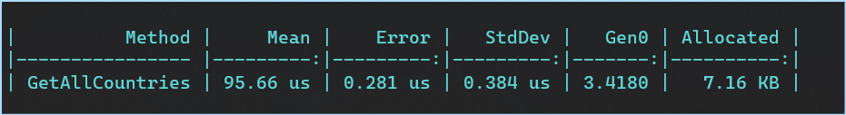

# RESTCountries.NET
A completely offline library to get information about countries.

Documentation of the previous versions can be found [here](https://github.com/egbakou/RESTCountries.NET/blob/main/LEGACY_README_V2.md).

## Setup

- Available on NuGet: https://www.nuget.org/packages/RESTCountries.NET/ [](https://www.nuget.org/packages/RESTCountries.NET/) 
- Install it into your dotnet project(.NET Standard, .NET Core, .NET, Maui, WPF, etc.).

## Version 3 features

| Features                                    |        v2.x.x         | Current version |
| ------------------------------------------- | :-------------------: | :-------------: |
| Offline support                             |           ❌           |        ✔️        |
| More translation languages                  |           ❌           |        ✔️        |
| Country postal code with regex              |           ❌           |        ✔️        |
| Google Maps and OpenStreetMap location       |           ❌           |        ✔️        |
| Country flag in unicode, png and svg format | Unicode not supported |        ✔️        |
| Time zones information                      |           ❌           |        ✔️        |
| Car information                             |           ❌           |        ✔️        |
| Start of the week                           |           ❌           |        ✔️        |
| Mobile phone prefix information             |           ❌           |        ✔️        |

## Benchmark



## Note

Add `namespace` `RESTCountries.NET.Services` and call `RestCountriesService` class to access all methods.

Each method returns an object of type [`Country`](https://github.com/egbakou/RESTCountries.NET/blob/main/src/RESTCountries.NET/Models/Country.cs) or a `IEnumerable` of [`Country`](https://github.com/egbakou/RESTCountries.NET/blob/master/src/RESTCountries.NET/Models/Country.cs). You can apply filters on the returned value to retrieve what you need. 

Example:

- Just get name and capital city of all countries.
- Get country names in French language or Spanish language.

The default language for the country name is English, but you can also get the name in other languages such as: **Arabic, Breton, Czech, Welsh, German, Estonian, Finnish, French, Croatian, Hungarian, Italian, Japanese, Korean, Dutch, Persian, Polish, Russian, Slovak, Spanish, Swedish, Turkish, Urdu and Chinese**.

## Usage

> Note: The list is already ordered ascending by the country name. 

- Get all countries

```csharp
// Get all countries
IEnumerable<Country> countries = RestCountriesService.GetAllCountries();
```

- Search by country name containing a "prefix"

```csharp
// Search by country name containing "a" or "A"
IEnumerable<Country> result = RestCountriesService.GetCountriesByNameContains("a");
```

- Search by country full name

```csharp
// Search by country full name
Country? result = GetCountryByFullName("Brazil");
```

- Search by Alpha-2 code or Alpha-3 code

```csharp
// Search by country code
Country? result = RestCountriesService.GetCountryByCode("us"); // or USA
```

- Search by  currency code, name or symbol

```csharp
// Search by currency code, name or symbol
IEnumerable<Country> result = RestCountriesService.GetCountriesByCurrency("EUR"); // Or Euro or €
```

- Search by language

```csharp
// Search by language
IEnumerable<Country> result = RestCountriesService.GetCountriesByLanguage("french"); // or fra
```

> You can use `var` instead of explicit types. I use explicit types to show you the return type of each method.
>

- Get only country names

```csharp
var result = RestCountriesService.GetAllCountriesNames().ToList();
```

Here, you can choose the language you want. check out the the [`TranslationLanguage class`](https://github.com/egbakou/RESTCountries.NET/blob/main/src/RESTCountries.NET/Models/Translation.cs) to see the available languages.

```csharp
//  Get country names in French langauge
List<string> result = RestCountriesService.GetAllCountriesNames(TranslationLanguage.French).ToList();
```

## Country class

```csharp
public class Country
{
    /// <summary>
    /// Country name
    /// </summary>
    public CountryName Name { get; set; }

    /// <summary>
    /// Top Level Domain of the country.
    /// </summary>
    public string[]? Tld { get; set; }

    /// <summary>
    /// The alpha-2 code of the country.
    /// </summary>
    public string Cca2 { get; set; }

    /// <summary>
    /// ISO 3166-1 numeric : https://en.wikipedia.org/wiki/ISO_3166-1_numeric
    /// </summary>
    public string? Ccn3 { get; set; }

    /// <summary>
    /// The alpha-3 code of the country.
    /// </summary>
    public string Cca3 { get; set; }

    /// <summary>
    /// International Olympic Committee Code.
    /// </summary>
    public string Cioc { get; set; }
    
    /// <summary>
    /// Is the country independent?
    /// </summary>
    public bool? Independent { get; set; }

    /// <summary>
    /// Status of the country. check out the https://restcountries.com/ for more info.
    /// </summary>
    public string? Status { get; set; }

    /// <summary>
    /// Is the country member of the United Nations ?
    /// </summary>
    public bool UnMember { get; set; }

    /// <summary>
    /// Currencies used in the country.
    /// The dictionary is the currency code, the value is a Currency
    /// object: {name: string, symbol: string}.
    /// </summary>
    public Dictionary<string, Currency>? Currencies { get; set; }

    /// <summary>
    /// International direct dialing.
    /// </summary>
    public Idd Idd { get; set; }

    /// <summary>
    /// Capital(s) of the country.
    /// </summary>
    public string[] Capital { get; set; }

    /// <summary>
    /// Alternative spellings of the country.
    /// </summary>
    public string[] AltSpellings { get; set; }

    /// <summary>
    /// Region of the country (eg. Africa, Americas, Asia, Europe, Oceania, Antarctic).
    /// </summary>
    public string Region { get; set; }

    /// <summary>
    /// The subregion of the country(eg. Western Africa, Western Europe, ...)
    /// <remarks>Can be null.</remarks>
    /// </summary>
    public string? Subregion { get; set; }

    /// <summary>
    /// Languages spoken in the country.
    /// The key of the dictionary is the language code, the value is a
    /// the language name in english.
    /// </summary>
    public Dictionary<string, string>? Languages { get; set; }

    /// <summary>
    /// Translations of the country name in other languages
    /// </summary>
    public Dictionary<string, Translation> Translations { get; set; }

    /// <summary>
    /// Gps coordinates of the country in the format: [latitude, longitude].
    /// </summary>
    private double[] LatLng { get; set; }

    /// <summary>
    /// Is the country landlocked?
    /// </summary>
    public bool Landlocked { get; set; }

    /// <summary>
    /// Neighboring countries.
    /// </summary>
    public string[] Borders { get; set; }

    /// <summary>
    /// The area of the country in square kilometers.
    /// </summary>
    public double? Area { get; set; }

    /// <summary>
    /// Demonym.
    /// </summary>
    public Demonyms? Demonyms { get; set; }
    
    /// <summary>
    /// Unicode flag.
    /// </summary>
    public string UnicodeFlag { get; set; }

    /// <summary>
    /// Google maps or OpenStreetMap link.
    /// </summary>
    public Maps Maps { get; set; }

    /// <summary>
    /// FIFA code.
    /// </summary>
    public string? Fifa { get; set; }

    /// <summary>
    /// Car information.
    /// </summary>
    public Car? Car { get; set; }
    
    /// <summary>
    /// List of timezones.
    /// </summary>
    public string[] Timezones { get; set; }

    /// <summary>
    /// Continent of the country. Only one continent is possible.
    /// The data source taken from https://restcountries.com/ return a list of
    /// one continent. That's why it's an array.
    /// </summary>
    public string[] Continents { get; set; }

    /// <summary>
    /// Flag(Url) of the country in png and svg format.
    /// </summary>
    public Flag Flag { get; set; }

    /// <summary>
    /// The week start by which day ? (eg. Sunday, Monday, ...)
    /// </summary>
    public string StartOfWeek { get; set; }

    /// <summary>
    /// Capital details. (eg. latitude, longitude, ...)
    /// </summary>
    public CapitalInformation CapitalInformation { get; set; }

    /// <summary>
    /// Postal code information (eg. format, regex).
    /// </summary>
    public PostalCode? PostalCode { get; set; }
}
```

## Issues

If you find an error in the data source, please create an issue on the restcountries.com repo available on GitLab(https://gitlab.com/amatos/rest-countries), where our local data comes from.

## Created by: Laurent Egbakou

- LinkedIn: [Laurent Egbakou](https://www.linkedin.com/in/laurentegbakou/)
- Twitter: [@lioncoding](https://twitter.com/lioncoding)

## License

The MIT License (MIT) see [License file](https://github.com/egbakou/RESTCountries.NET/blob/master/LICENSE)

## Contribution

Pull requests are more than welcome! If you do submit one, please make sure to read the [contributing guidelines](https://github.com/egbakou/RESTCountries.NET/blob/main/CONTRIBUTING.md) first.
